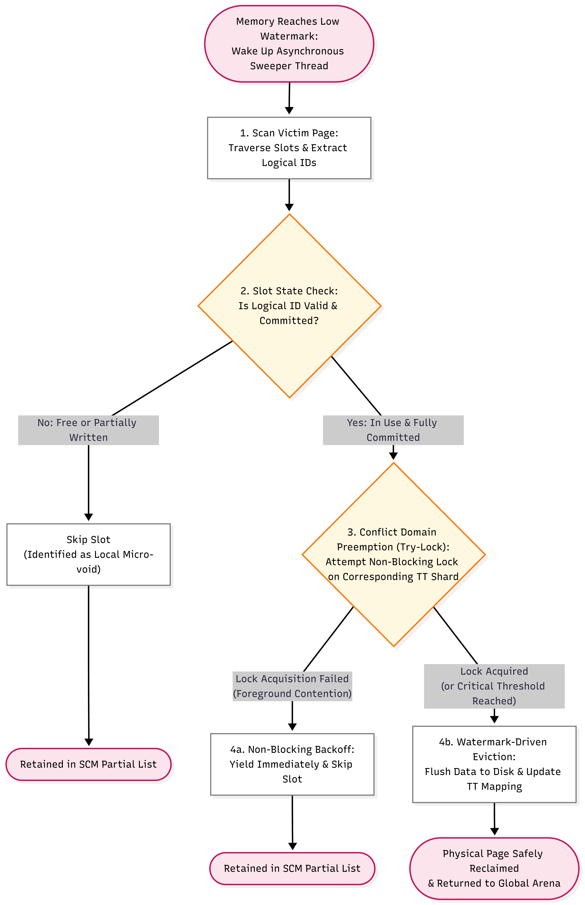

# Slab-like K-V Engine with Hot Record Rescue
This is a kernel-bypass, slab-like key-value storage engine. I code this engine to complete my research on "hot spot rescue", which is the machaniam and policy that helps to keep the most accessed records in RAM when Data Size >> RAM Size. Such feature is essential for almost every In-Memory DB. 

Basically the engine will have to manage the allocation, free and swap-in/out of free space without relying on the default options provided by OS. This doc will explain the architectural design of this project.

If you are interested in running the project, See [This Section](#compile-and-run).

## Design of Memory Pool
This part involves the `Arena` and `SizeClassManager(SCM)`. 

### Arena
Arena is the global memory pool, which requests a configurable block of memory from the OS, locks it in RAM using `mlock`, and logically divides it into standard 4KB pages. The entire storage engine relies on this pre-allocated space to store records.  

For page allocation, Arena pairs a 64-bit atomic bitmap with a heuristic cursor to find free pages in $O(1)$ without global locks or scanning from index 0.  

> I avoided a buddy allocator design because the system is specifically optimized for extremely fast operations on small records. It is far more effective to implement a dedicated, separate allocation path for large records rather than mixing both paradigms in the same pool.

The other core responsibility of Arena is monitoring global memory pressure. Arena continuously tracks usage against high, low, and critical watermarks, automatically signaling the background sweeper thread to initiate page reclamation.   

### SCM
SizeClassManager (SCM) is the fixed-length slot allocator that sits on top of Arena. It takes the 4KB logical pages managed by Arena and partitions them into uniform slots tailored for specific record size classes. 

SCM manages pages through a single linked list of partially full pages (`partial_list_head`). Full pages are unlinked to prevent $O(N)$ traversal, while empty pages return to Arena instantly. 

Slot availability within a page is tracked using an explicit bitmask array (`is_allocated`) located in the page header, allowing $O(1)$ slot location via hardware `__builtin_ctzll` instructions. 

The other primary responsibility of SCM is cooperating with the background eviction subsystem. Through `quarantine_page()` and `unquarantine_page()`, SCM allows the Sweeper thread to safely isolate victim pages from frontend write paths while preventing double-free race conditions.  

### The Lifecycle of Page


## Design of DB Operations
The engine support standard K-V storage interface like `put()`, `get()` and `del()`. This part explains the internal structure and mechanism that support those operations.

### Metadata with Sharded Locks
To support $O(1)$ key-value operations while enabling efficient reverse lookups for background eviction, the engine decouples string key management from physical storage locations using a two-tier secondary index built on intermediate Logical IDs. Managed separately from the main Arena pool, this layer routes requests through two distinct structures: a Sharded Hash Table and a global Translation Table (TT).

```txt
[Key] ---> (Sharded Hash Table) ---> [Logical ID] --
--> (Translation Table array) ---> [RAM Pointer / Disk Offset]
```

- Sharded Hash Table: Maps variable-length string keys to unique Logical IDs. This key-to-ID mapping remains static throughout the lifetime of the key-value pair.  
- Global Translation Table (TT): A dense array indexed directly by Logical ID. To minimize memory footprint, each TT entry (RecordLoc) is packed into a tight 16-byte structure using C++ union fields.

### Operation's Workflow(try-rollback)
To prevent deadlocks between foreground worker threads and background Sweeper evictions, the engine replaces traditional "lock-first" allocations with an optimistic Execute-Recheck-Rollback protocol:

```txt
[1. Execute]   Optimistically pre-allocate physical slot from SCM (Lock-Free).
      │
[2. Recheck]   Acquire TT Shard Lock -> Validate key mapping & TOCTOU state.
      │
   ├─── SUCCESS ──> [Commit]   Update TT pointer & finalize write.
   └─── FAIL ─────> [Rollback] Free pre-allocated slot -> Retry operation.
```

## Design of Background Sweeper
The Sweeper is an asynchronous background thread responsible for memory reclamation when global Arena watermarks are breached. 

### Hotness Evaluation & Rescue Policy
To prevent coarse page eviction from mis-killing active hot records, the engine combines slot-level access tracking, page-level clock exemptions, and zero-I/O hot record rescue. 

- Slot-Level 2-Bit Clock: Inspired by Linux MGLRU, each slot uses a 2-bit counter (0–3) modified via lock-free CAS loops. Foreground reads and writes increment the counter via lock-free CAS loops. The Sweeper applies atomic temporal decay during background sweeps.
- Page-Level Clock Exemption: Before evicting an LRU victim page, the Sweeper aggregates the hotness of all its slots. If the sum exceeds a threshold, the entire page earns a "second chance".
- Precise Hot Rescue: For un-exempted victim pages, the Sweeper rescues max-heat records (heat = 3) by moving them into existing micro-voids in partially full pages via `scm.alloc_notrigger()`. 

### Sweeper Workflow
The logic of sweeper is defined in `StorageEngine.cpp`, see `evict_cold_page()` and `page_hot_rescue()`. Outlined in the flowchart below:



## System Evaluation

**Platform:** Basically WSL2 on my PC, which has Intel Core i7-14700HX CPU (20 cores / 28 threads) with DDR5 RAM and an NVMe SSD, running Ubuntu 22.04 LTS. Compiled using `g++ -O3`. 


**Workload Configuration:** Benchmarked under an 8-thread YCSB workload configured for 95% Read / 5% Update under extreme Zipfian skew ($\theta = 0.99$).


**Capacity Inversion Pressure:** Managing 1,000,000 variable-length records (~127.8 MiB logical data) requires ~191.6 MiB of physical RAM when fully resident. With the global Arena strictly capped at 64 MiB, the system operates under a severe **2.99:1 effective capacity inversion ratio**, forcing active background swapping.

Enabling Page Clock Exemption and Hot Rescue suppressed P99 tail latency by **54.6%** (dropping from 14.96μs to 6.79μs) while boosting overall throughput to 5.99 M ops/s under heavy memory inversion.

| Metric | Baseline (Disabled) | Optimized (Enabled) |
| --- | --- | --- |
| **Throughput** | 5.51 M ops/s | **5.99 M ops/s** |
| Average Latency | 1.32 μs | 1.21 μs |
| P50 Latency | 0.50 μs | 0.50 μs |
| **P99 Latency** | 14.96 μs| **6.79 μs (-54.6%)** |
| Cache Hit Rate | 85.35% | 87.39% |
| Hot Rescue Count | 0 | 1,301 M |


## Compile and Run
I have included a makefile and several scripts to make things easier. Use:
```bash
> make clean && make benchmark
```
to generate the benchmark binary. Then use `./build/db_bench` to run. 

The benchmark support multiple CLI args that changes the configuration of the engine or benchmark itself, run the benchmark with `--help` to view all args.

There are also some script that test how this engine scales with thread number and record size, run `test_threads.sh` and `test_value_size.sh` to get a result on your own.